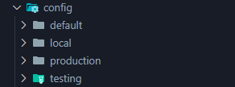
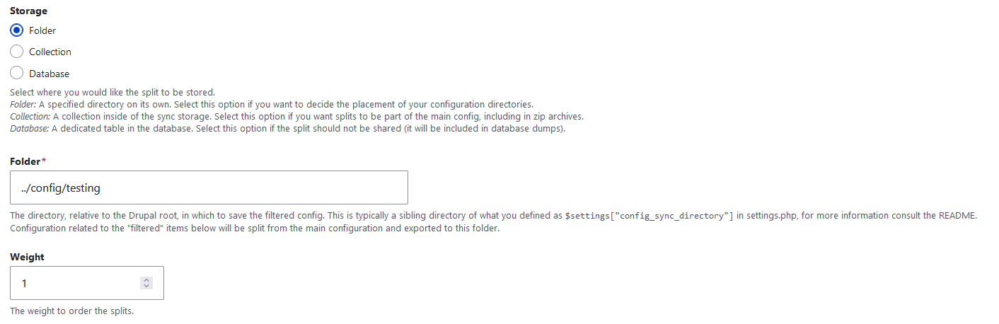
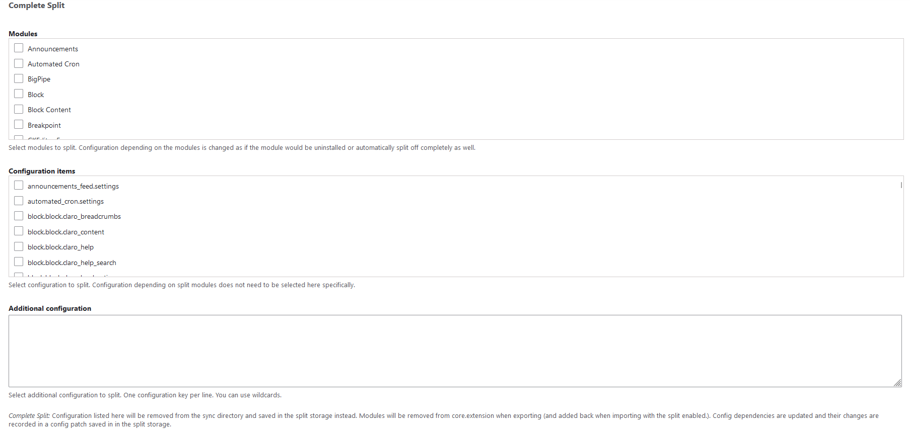
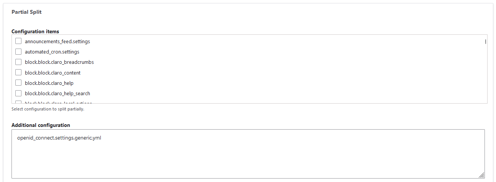
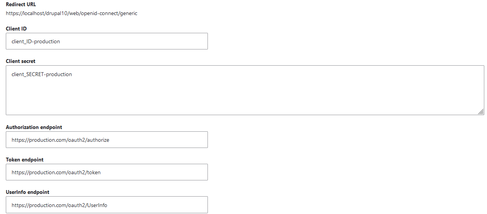
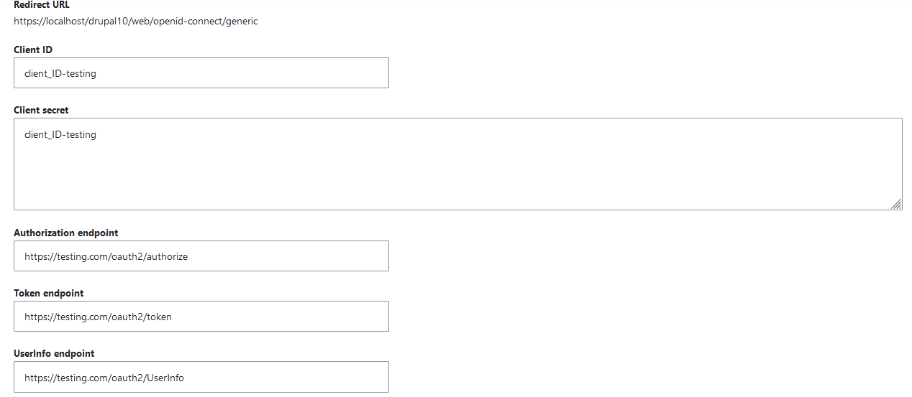

The most comprehensive explanation of the module comes from the official project page [[this](https://www.drupal.org/project/config_split)]: *"This module allows to define sets of configuration that will get exported to separate directories when exporting, and get merged when importing. It is possible to define in settings.php which of these sets should be active and considered for the export and import."*

Imagine that we have three environments: **local**, **testing** and **production**; and you created a custom module with a config form with fields: *field_key* and *field_secrets*. The value of these fields should change for every environment we have to manage.

Again, imagine that we want to enable specific modules in a developing environment, but we do not want these modules in the production environment because of performance.

How do you manage to do it? Using **Config Split!**

## Create the different environments:

Before the settings of Config Split, we need to create the folders in which the module needs to export the YML files.

In this case, we can have three folders:

* *config/default*
* *config/local*
* *config/testing*
* *config/production*

In particular, *config/default* should be the folder in which you exported all the configurations, so the folder we set in **settings.local.php**



Okay, now we can create the settings [go to */admin/config/development/configuration/config-split*]; we will make only one example in this instance, but you can replicate it for every other environment.

The first part we can set is the **storage type**:



In this case, I chose a folder, specifically the corresponding folder for **testing**. Every YML file for local will be put in this folder.

Let's skip the setup of the activation/or not of the setting because this is the task of the written code into **settings.local.php** and go on to the most important sections.

In the complete split section, we have some ways to split:

1. We can choose to split a complete module and its configuration files [example: *devel*, which should be enabled only on a local environment];
2. We can choose to split a specific YML file [example: *system.logging.yml*, to save all messages, with backtrace information but not in production];
3. We can choose to split specific YML files we can write directly in textarea: such as our fields mentioned before];

In my case, I choose to split completely [Devel](https://www.drupal.org/project/devel) and [Devel Entity Updates](https://www.drupal.org/project/devel_entity_updates) modules, to make this module active only in the **development** environment. In the same way, in the production environment, we want active, for example, the [OpenID Connect](https://www.drupal.org/project/openid_connect) module.



Now, you can export all the configurations with the usual CLI command:

**drush cex --no-interaction**

Then you should export the env-specific configuration files using the CLI command [you can see the complete documentation [here](https://www.drupal.org/docs/8/modules/configuration-split)]:

**drush config-split:export {specific environment, like local}**

Note that you should activate in advance the environment you want to export.

## Install Dotenv and switch to the right env:

In Drupal, we can use a **.env** file in which we can specify all the env-dependent variables, such as the specific env. An example can be the following: 

```yaml
# Environment: local, testing, production.
APP_ENV=production

# DB information.
DB_NAME=
DB_USER=
DB_PASSWORD=
DB_HOST=
DB_PORT=
DB_DRIVER=
DB_PREFIX=
```

We can make this using this module: [Dotenv](https://www.drupal.org/project/dotenv).

After the definition of the env variables, we can use them in our **settings.local.php**:

```php
<?php

# [...]

if (isset($_ENV['APP_ENV'])) {
  $envSettings = [
    'local' => [
      'config_split.config_split.local' => true,
      'config_split.config_split.testing' => false,
      'config_split.config_split.production' => false,
    ],
    'testing' => [
      'config_split.config_split.local' => false,
      'config_split.config_split.testing' => true,
      'config_split.config_split.production' => false,
    ],
    'production' => [
      'config_split.config_split.local' => false,
      'config_split.config_split.testing' => false,
      'config_split.config_split.production' => true,
    ],
    # Add more environments here as needed...
  ];

  $currentEnv = $_ENV['APP_ENV'];
  if (array_key_exists($currentEnv, $envSettings)) {
    foreach ($envSettings[$currentEnv] as $key => $value) {
      $config[$key]['status'] = $value;
    }
  }
}
```

Using this, every time we import the configuration files [using **drush cim**], Config Split choose the right environment \[from the .env] and makes the changes we want for that specific environment. 

**In production**: disable Devel and Devel Entity Updates, and enable OpenID Connect \[with all dependencies and configurations];

**In local**: enable Devel and Devel Entity Updates, and disable OpenID Connect;

### If you want a different value for the same key?

For example, you want to connect different IDPs for testing and production. Of course, client ID and secret should be different.

So we can accomplish this using a partial split of the YML file both in **testing** and **production** configuration-env: **openid_connect.settings.generic.yml**



So, in production we can have this configuration:



While in testing we have:



In the end, we have the same module enabled in both environments but with different information.

## And for the sensitive data?

If you have sensitive data, like the well-known configuration of your IDP, you can use the option Database for the Storage type inside the Config Split environment configuration.

This option uses a \[...] *dedicated table in the database. Select this option if the split should not be shared (it will be included in database dumps).*

Of course, this is not the final solution. To make the information more secure, you should hash it before saving.

## More simple alternative:

If you only want to ignore some specific configurations, you do not need to configure all the Config Split; you need [Config Ignore](https://www.drupal.org/project/config_ignore). 

Using Config Ignore you can specify the whole configuration file \[YML] you want to ignore for the other environments.

## Final considerations:

Of course, this doesn't want to be an exhaustive guide about how to use Config Split in any circumstances but it wants to be a simple tutorial about how I used Config Split for some of my cases.

On the Internet, there is a huge amount of information about Config Split, videos and tutorials, like this: [Drupal Con Vienna](https://events.drupal.org/vienna2017/sessions/advanced-configuration-management-config-split-et-al).

### Tip:

You can use [Configuration Read-only mode](https://www.drupal.org/project/config_readonly) to make sure that the configuration will not change in the production environment.