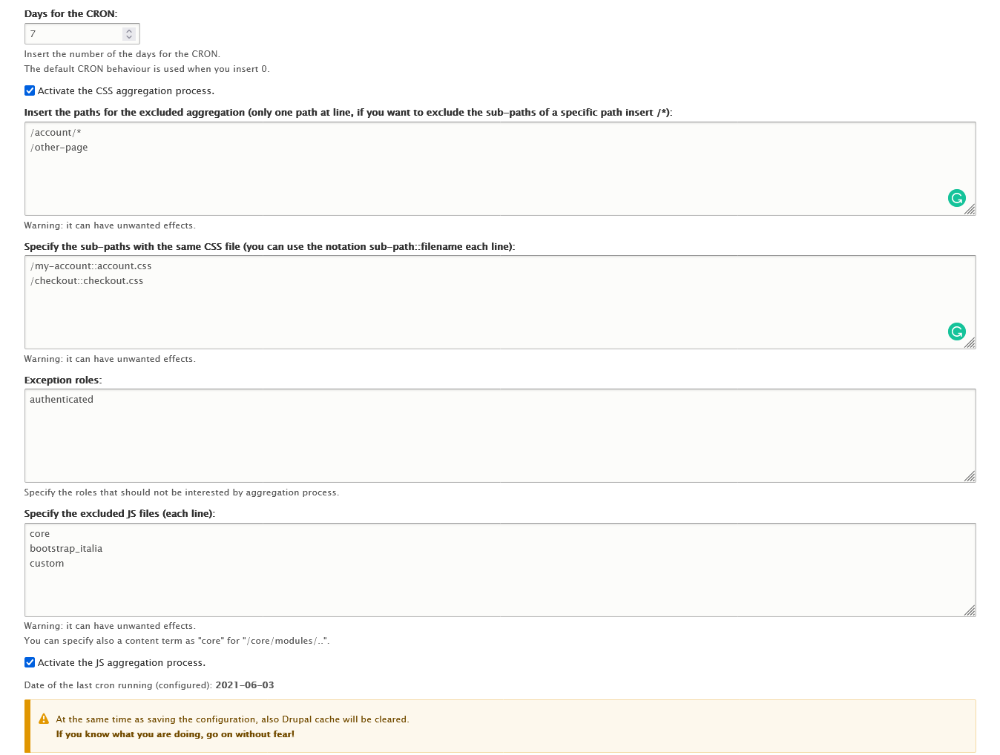

When you use a CMS, often you saw that your pages peed (Google) value is lower than you think, but it is a normal thing because you used a CMS to build your website! 

But our desire is always to see that value at least more than 60-70% for Desktop and 50-60% for mobile (if you consider that more traffic today came from mobile devices). I want to start with this: with Drupal, it is difficult to have high values because (of course) it is heavy and it is a substrate that you use behind your application! 

My intention isn't to give you a tutorial like *how to use this module, or how to \[put other things]* but it is to give you some advice to follow to increase the performance of your Drupal website.

The solution exists, and I list them: 

* You can use the contrib module called [Advanced CSS/JS Aggregation](https://www.drupal.org/project/advagg) that helps you with the optimization of CSS and JS that your website needs; the configuration of this module is simple and described well by the documentation,
* Use *lazyloading* for the images you used into the website, and more important thing, use the *srcset* to adapt these images to the specific devices; there are some modules (stable) that help you: 

  * [Image SRCSET Formatter](https://www.drupal.org/project/image_srcset_formatter),
  * [Lazy-load](https://www.drupal.org/project/lazy),
  * [Blazy](https://www.drupal.org/project/blazy);

Now, it is time to show! The most important point is this: during these days I develop a module that aggregates into one or fewer files the CSS and JS files, so your browser need to request many fewer resources.

In particular, the module unifies all CSS and non-core JS files into one file. In a complex website, the requests came from 56 to 14, and the pagespeed, applying the modules that I cited before came from 30% (mobile) and 45% (desktop) to 65% (mobile) and 88-95% (desktop).

#### How to use CSS/JS Performance Improvement

The module is simple, it has only two configuration pages that you need to set up. The first of all is the CRON settings (*/admin/config/css_js_performance_improvement/cron*) thanks to you can set the number of days that the Drupal cache needs to be clear, this is because the cache clearing behaves the deletion of the two merged files into */sites/default/files/public/css_js_performance_improvement/\[css or js]*. 

When these files do not exist, they will be re-generated from the first anonymous user that visits the website.

Also, on this page, you can check the aggregation of CSS or JS files, or deactivate it!

Another important page is */css_performance_improvement/form/delete_css* where you can manually delete all merged files, so you can re-generated it with the same process explained before.

This is my second module, that you can find here: CSS/JS Performance Improvement. 

Enjoy :-)