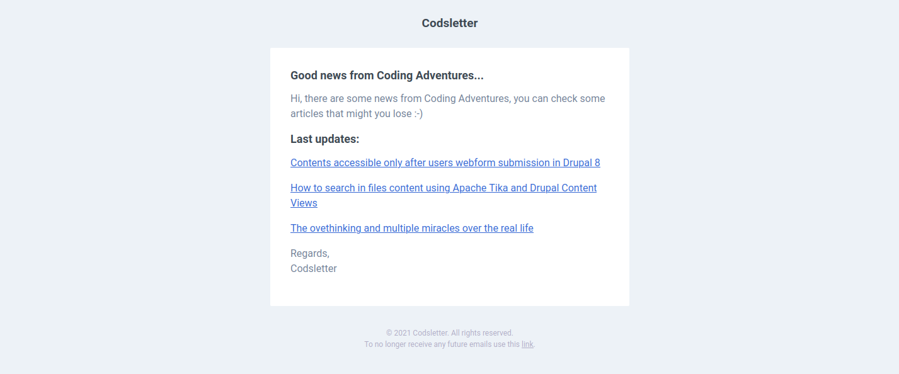

Some days before, I added to every post a small "banner" to my BuyMeCoffee page, and it looks great (you can see it at the bottom of this post). But I need more (not money), I need an engagement with my (today small... very small) audience, and because I do not want to insert a comment system to my post (because of performance), I need something other.

Why I don't want comments above my posts? For two reasons:

1. I don't want to slow down my blog with some third-party system,
2. I haven't so much time to reply to every comment, eventually (even if there weren't that many, I guess);

So, what is the solution? A completely automated newsletter! I looked at some solutions on the Internet, and many seem perfect for a newsletter system, but there is a problem (for me): all of them presuppose that I write the newsletter and send it to my audience within the system itself. For other users, this can be an interesting feature, and most of the time you need to personalize your newsletter before send it and seem legit. But, as I said before in this post, I haven't so much time because of work and personal things, so I need something that make the dirty work for me.

So, I created **[Codsletter](http://codsletter.herokuapp.com/)**. I can choose a minimum number of posts to send with a newsletter and a range of times to schedule the sending. For example: if I set 3 as the minimum number of posts to send and 7 days the scheduler; every day the website will be scraping and if there are at least 3 new posts (based on the last newsletter sent) and it's been at least 7 days, the system will send the newsletter to my users base.

But, the template of the newsletter? Well, I built only one template, for now, but I hope that in the future I will make some other templates and give them to the users.

An example of a newsletter sent are the followed:

Why you should use Codsletter? For three main reasons:

1. It is completely **open-source**, I published it on my GitHub profile and you can use it however you want,
2. If you are a **laziness person** and you want something that makes a good work for less,
3. It is **free to use**, so you can register yourself and add your website, generate a form and add it to your page;

Thank you for your attention. The project page is the followed if you want to contribute or to see how codsletter works: [Codsletter on GitHub](https://github.com/mariolinguito/codsletter) while if you want to try the application, this is the link: [Codsletter on Heroku](http://codsletter.herokuapp.com/)