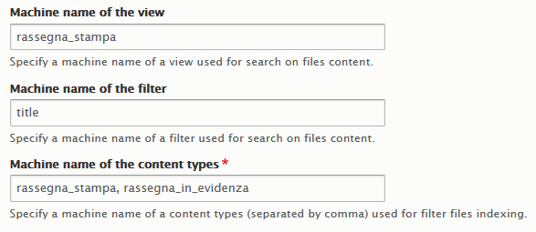
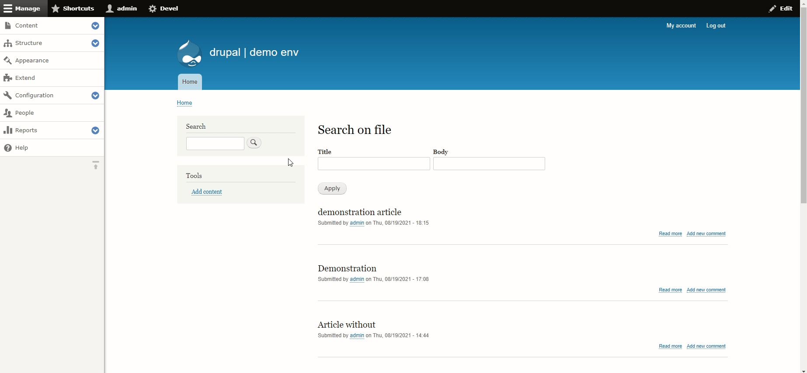

There are some contrib modules for Drupal 8 that make you search into the files, all of these uses Apache Tika, which is a framework used for content analysis and detection.

But, before the start, I need to expose my limitations so you can understand why a choice instead of another:

1. I can't use Search API, consequently, I cannot use Search API Attachments, a module that uses Search API to perform the extraction and the analysis of the file contents,
2. I need to use the default Drupal search engine, and the default indexing system that it uses,
3. I need to perform the searching into an existing content view and it has to work with a pre-existent filter on this view;

The module that I used to accomplish all the three points explained above is [Search File Attachments](https://www.drupal.org/project/search_file_attachments)... with some extra functions that I wrote for!

In particular, what I made *in plus* for this module is the possibility of the use of a filter it already exists into a view to make a search into the files. For my example, I used the "title" exposed filter on a view to make a search both into content title and files content, to do this I added a hook into the .module file that alters the query that the view makes to display the elements.

```php
/**
 * Implements hook_views_query_alter().
 */
function search_file_attachments_views_query_alter(ViewExecutable $view, QueryPluginBase $query) {
  $config = \Drupal::config('search_file_attachments.settings');
  $view_machine_name = $config->get('view_machine_name');
  $filter_machine_name = $config->get('filter_machine_name');

  if ($view->id() === $view_machine_name) {
    $filter_value = $view->filter[$filter_machine_name]->value;

    if(!empty($filter_value)) {
      $filter_value = str_replace(' ', '|', $filter_value);
      $database = \Drupal::database();
      $file_join = $database->select('file_usage', 'fu');
      $file_join->join('search_dataset', 'sd', 'fu.fid = sd.sid');
      $file_join->condition('sd.data', $filter_value, 'REGEXP');
      $file_join->fields('fu', ['id']);
      $file_results = $file_join->execute();
      $ids = array_keys($file_results->fetchAllAssoc('id'));

      if(!empty($ids)) {
        $in_statement = db_or()->condition('node_field_data.nid', $ids, 'IN');
        $query->addWhere(2, $in_statement);
      }
    }
  }
}
```

Of course, the name of the view and filter can be specified from users into the configuration page of the module (I added three more forms for this purpose).



The file that I changed, in this case, is *search_file_attachments/src/Form/SearchFileAttachmentsSettingsForm.php* and in particular, I added some input using the same form schema that the module already uses. 

```php
$form['tika']['search_file_attachments_view_machine_name'] = array(
  '#type' => 'textfield',
  '#title' => t('Machine name of the view'),
  '#default_value' => $config->get('view_machine_name'),
  '#description' => t('Specify a machine name of a view used for search on files content.'),
  '#required' => FALSE,
);

$form['tika']['search_file_attachments_filter_machine_name'] = array(
  '#type' => 'textfield',
  '#title' => t('Machine name of the filter'),
  '#default_value' => $config->get('filter_machine_name'),
  '#description' => t('Specify a machine name of a filter used for search on files content.'),
  '#required' => FALSE,
);

$form['tika']['search_file_attachments_ct_machine_name'] = array(
  '#type' => 'textfield',
  '#title' => t('Machine name of the content types'),
  '#default_value' => $config->get('ct_machine_name'),
  '#description' => t('Specify a machine name of a content types (separated by comma) used for filter files indexing.'),
  '#required' => TRUE,
);
```

Another improvement (or is better to say, adaptation) that I make is to limit the indexing of files into the file search page (that is the default in Drupal), so if we need to limit the search only on specific files related to specific content types, we can do this altering some queries into a file. This piece of code related to the functions at lines 247 and 263 of the file placed in *search_file_attachments/src/Plugin/Search/FileSearch.php*

```php
/**
 * {@inheritdoc}
 */
public function indexStatus() {
  $included_cts = $this->moduleSettings->get('ct_machine_name');
  $included_cts = array_values(explode(',', str_replace(' ', '', $included_cts)));
  $total = $this->database->query("
    SELECT COUNT(*) 
    FROM {file_managed} f 
    WHERE status = 1 AND f.fid 
    IN (
      SELECT fu.fid 
      FROM file_usage fu LEFT JOIN node n 
      ON fu.id = n.nid 
      WHERE n.type 
      IN (:included_cts[]))", [':included_cts[]' => $included_cts])->fetchField();
  
  $remaining = $this->database->query("
    SELECT COUNT(*) 
    FROM {file_managed} f LEFT JOIN {search_dataset} sd 
    ON sd.sid = f.fid AND sd.type = :type 
    WHERE f.status = 1 AND (sd.sid IS NULL OR sd.reindex <> 0) AND f.fid 
    IN (
      SELECT fu.fid 
      FROM file_usage fu LEFT JOIN node n 
      ON fu.id = n.nid 
      WHERE n.type 
      IN (:included_cts[])
    )", [':type' => $this->getPluginId(), ':included_cts[]' => $included_cts])->fetchField();

  return array('remaining' => $remaining, 'total' => $total);
}

/**
 * {@inheritdoc}
 */
public function updateIndex() {
  // Interpret the cron limit setting as the maximum number of files to index
  // per cron run.
  $limit = (int) $this->searchSettings->get('index.cron_limit');
  $included_cts = $this->moduleSettings->get('ct_machine_name');
  $included_cts = array_values(explode(',', str_replace(' ', '', $included_cts)));

  $result = $this->database->queryRange("
    SELECT f.fid, MAX(sd.reindex) 
    FROM {file_managed} f LEFT JOIN {search_dataset} sd 
    ON sd.sid = f.fid AND sd.type = :type 
    WHERE sd.sid IS NULL OR sd.reindex <> 0 
    GROUP BY f.fid HAVING f.fid 
    IN (
      SELECT fu.fid 
      FROM file_usage fu LEFT JOIN node n 
      ON fu.id = n.nid 
      WHERE n.type IN (:included_cts[])
    ) 
    ORDER BY MAX (sd.reindex) is null DESC, MAX (sd.reindex) ASC, f.fid ASC", 
    0, $limit, 
    [':type' => $this->getPluginId(), ':included_cts[]' => $included_cts], 
    ['target' => 'replica']
  );

  $fids = $result->fetchCol();

  if (!$fids) {
      return;
  }

  $file_storage = $this->entityManager->getStorage('file');
  foreach ($file_storage->loadMultiple($fids) as $file) {
      $this->indexFile($file);
  }
}
```

In the end, using a contrib module we extended their functionalities to adapt it to our needs, and this is awesome.

That is the Drupal world, baby!

I published the patch on the main page of the module: [here, take a look!](https://www.drupal.org/project/search_file_attachments/issues/3229585)

### Yes, but show me the goods

