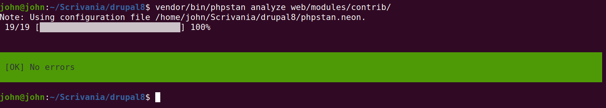

Today some tools help us to write better code and avoid logic errors, consequently avoiding bugs. One of these tools is **PHPStan** (link here), an open-source (just for this you should love it) and free-to-use (it has also a premium version) PHP static analysis tool that aims to make your code better.

As you can use PHPStan for PHP code, you can use it also for your Drupal module, and the luck wants that someone on the magical world of the Internet made integration of PHPStan in Drupal. This someone has a name: Matt Glaman, a developer that sometimes makes videos and writes on his blog (you can find it here).

Thanks to his work, I used PHPStan to analyse my code and projects published on my Drupal profile. You can find my two articles related to these modules on this blog.

**I want to say something before:** the main topic of the post is not an exhaustive guide about how to use PHPStan on every project or every Drupal module; instead, this post wants to be more like a diary on how I'm improving my Drupal projects. I will cover only something about PHPStan (the things that help me to accomplish my goals).

If you want to learn how to use PHPStan massively and more completely, you can check the official documentation whose links are scattered in this blog post.

## How to use PHPStan with Drupal

We can use PHPStan simply using composer, and if you know how to manage and make modules for Drupal, you already had to have an affair with the composer package manager.

So, the first thing we should do is to install PHPStan (and its dependencies) on our project, using the previously cited composer:

```shell
composer require  --dev phpstan/phpstan \
  phpstan/extension-installer \
  mglaman/phpstan-drupal \
  phpstan/phpstan-deprecation-rules
```

After that, we need to define a configuration file to fit our requirements about the module we need to test and eventually fix. This file is called *phpstan.neon* and based on the documentation (that you can find here), you need this file in complex scenarios that you cannot cover with command-line only. The format it uses is NEON (follow this [link](https://ne-on.org/) if you want to know more) which is similar to the YAML format (used by Drupal modules and configurations, so it is familiar for Drupal developers).

If a neon file was defined before in the current working directory, so PHPStan will recognize it automatically and use it.

In this case, I'm using the simple *phpstan.neon* file and not *phpstan.neon.dist*, that is preferred in a versioned context (using GIT, for example). The source code of the file is:

```yaml
parameters:
	level: 5
```

As you can see, my configuration file is pretty simple; it defines only a level of the check. The software itself define 0 as the lowest level of controls, and 9 as the highest. I don't want to tell you now what every level checks because you can read this information on the documentation (this is the [link](https://phpstan.org/user-guide/rule-levels) to follow if you want to go deeper).

## Check some errors in my code

Well, we are ready to check some errors in the code. The first module that I want to analyze is **CSS/JS Performance Improvement** (you can find it [here](https://www.drupal.org/project/css_js_performance_improvement)) and the command-dragon-line to lunch is:

```shell
vendor/bin/phpstan analyze web/modules
```

Of course, we have some errors to handle and fix for the modules created previously. So let's roll up our sleeves and begin to fix something broken.

## The process of fixing some sh*t

The simplest thing that the software reported to me is the *variable not found or defined* at line 50 of the module file. The variable related to service (that I used to make some operations on folders and files) is not defined in the hook. Pretty simple, I defined the same variable that I just used into another hook.

The software also reported to me some deprecated lines of code, for example, the *path.alias_manager* that now is *path_alias.manager* so we can make a substitution of the line with the new one.

Well, until now there was a simple solution to a simple problem. Another thing that we should resolve is the deprecated function *drupal_set_message*. I love the fact that the Internet gives me a solution to almost everything especially about Drupal, one of the most important and powerful content management frameworks. I found a really useful list of examples about how to use the new *addMessage* function in Drupal.

```php
<?php

// The drupal_set_message() function is being deprecated!
// @see https://api.drupal.org/api/drupal/core%21includes%21bootstrap.inc/function/drupal_set_message/8.5.x
// > Deprecated in Drupal 8.5.0 and will be removed before Drupal 9.0.0.
// > Use \Drupal\Core\Messenger\MessengerInterface::addMessage() instead.

// In some custom code.
\Drupal::messenger()->addMessage('Say something else');

// When trying to print out a simple var.
\Drupal::messenger()->addMessage(print_r($stuff, TRUE));

// In a Drupal 8 Form's submitForm() handler:
$this->messenger()->addMessage($this->t('Hello world.'));
```

Thanks to this snippet, now I can replace all deprecated functions with this new one.

Wow! Another problem was fixed. So, we are ready for the module file (of course we need to test the whole module to be sure that everything is working well).

The second file that gives me problems is *DeleteCSS.php*; the most reported error is *\Drupal calls should be avoided in classes, use dependency injection instead* and I'm afraid to say that yes, my gosh, you are tremendously right my little and dear PHPStan. To fix this problem I have to make some changes to my files, but these are useful to make the code more securely!

With the changes I made to the file, that I write here, I'm following the best practices of Drupal development, so instead of using *\Drupal* calls, now I'm using the injection. Yes, I lost some of my time understanding how to refactor my code, but in the end, I have not almost any errors.

The last warning we have on this file is more a suggestion than a report: *Unsafe usage of new static()* followed by a link that you can consult to solve your problem fast. In fact, the only thing that I made for this file is to set the class *final*. Remember that a *final* class cannot be extended.

Perfect, we are ready for the next adventure: fixing the last file of this module. But if we see with attention the errors, we will notice that all of them are similar to the previous errors we solved. In particular, in this case, we need to switch from an incorrect implementation of a service to an injection method.

We are lucky, because of the experience of the second file, we can fix the last one simply.



In the end, we killed all the problems!

## Go to the second project!

I made a second Drupal module that we can check with the same tool, its name is **Bootstrap Block Italia** (link on [Drupal page](https://www.drupal.org/project/bootstrap_block_italia)).

This module is simpler than the first module I made because it provides only some custom block based on a contrib theme called **Bootstrap Italia** provided by [Arturo Panetta](https://www.drupal.org/u/arturopanetta) (I thank you so much).

After the downloading and installation of the module, we need to lunch the same command also for this.

We are *extremely* lucky because there are no errors to know for this module, but we need to change something: the core compatibility just because Arturo Panetta made this module compatible with Drupal 9.

## Conclusion

In the end, I want to say that this is an extremely important and powerful tool that every developer need to use. I found it some days ago, but I think that I will use it even when I will make a new module.

I use this moment to study this tool and make changes to my module that I need to do some time ago, but I have no time for anything in this period, unfortunately. Yet I want to start a new way of improvement of my code using tools and best practices, so I think I will use this tool also on [Codsletter](https://codsletter.herokuapp.com/) (my last project built with Laravel).

You can check the changes I made on both modules on their official page on Drupal.org!