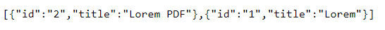
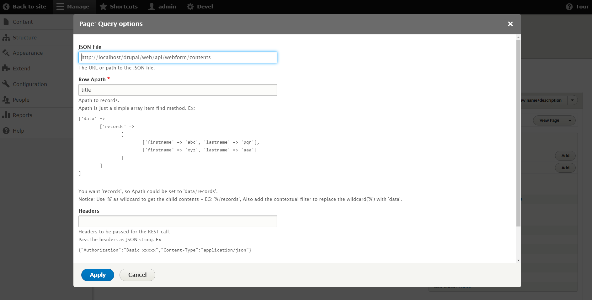

These days I had a tough nut to crack specifically in Drupal 8 because I need a method to hide some contents (of specific content type) from users that cannot be registered previously using a webform.

Everyone that used Drupal before in life used also Webform, the contributed module that allows you to create forms and much more (like handlers related to, specific layout and others). Well, I faced a single problem: how can I hide articles from users that didn't compile the form for specific content?

So I started to search (as any others) a contributed module that can help me, maybe related to the Webform ecosystem (that is big), but I didn't find anything, only someone that speaks about Rule integration with Webform. Yes, use Rule can make the magic, but I need something more light, and that does not involve many other modules.

After that, I started to think about a custom solution and I divided it into three steps:

1. A custom table that can track the users that compile a form above the specific content they want to read (or see) with this information: *id*, *id_user* and *id_content*;
2. When the user reload the page of the specific content he can now read the content; so there is a check (that I created using *a hook*) on content loading that checks if the user is tracked into the table for that content (only for the specific content type we set previously);
3. A custom REST endpoint that returns for a specific user all the content he can read because he compiled the form previously, so the view (created with a specific module that populates the rows with an API call) can show all the contents he signed.

Maybe, the most difficult step is the third, but we go by steps. Note that during the explanation I copy-and-paste some code from my custom module, but you can download the whole code and install the module into your Drupal website. Initially, I published the module on my GitHub profile, and I linked it at the end of this article.

## 1. Custom table for tracking

I used a specific hook to create a custom table while module installation, and essentially the code is this:

```php
/**
 * Creates the tables using the schema API.
*/
function webform_content_access_schema() {
  $schema['webform_content_access_track'] = [
    'description' => 'Tracking for content access with webform submissions.',
    'fields' => [
      'id' => [
        'description' => 'ID of the row.',
        'type' => 'serial',
        'not null' => true,
      ],

      'id_user' => [
        'description' => 'ID of the user.',
        'type' => 'int',
        'unsigned' => true,
        'not null' => true,
        'default' => 0,
      ],

      'id_content' => [
        'description' => 'ID of the content.',
        'type' => 'int',
        'unsigned' => true,
        'not null' => true,
        'default' => 0,
      ],
    ],

    'primary key' => ['id', 'id_user', 'id_content'],
  ];

  return $schema;
}
```

The information that the table track is the id (auto-increment column), the id of the specific user that submits the form, and the id of the specific content he wants access to.

After the submission (through a handler) the module writes the information into the table. But, how webform submission can be triggered (if not with a hook)? I created a custom handler that makes the work for me, and the code is this:

```php
class InsertTrackWebformHandler extends WebformHandlerBase {

  /**
   * {@inheritdoc}
   */

  // Function to be fired after submitting the Webform.
  public function postSave(WebformSubmissionInterface $webform_submission, $update = true) {
    // Get an array of the values from the submission.
    $values = $webform_submission->getData();
    $connection = \Drupal::service('database');
    $id_content = $webform_submission->getSourceEntity()->id();
    $id_user = \Drupal::currentUser()->id();

    $result = $connection->insert('webform_content_access_track')
      ->fields([
        'id_user' => $id_user,
        'id_content' => $id_content,
      ])->execute();
  }
}
```

The only thing that remained to be done is to add this handler into the specific webform settings:

\[GIF]

Every time that a user submits the form, the handler will be triggered and he writes the row with the information into the previous table.

## 2. Check the user and the content

The check of the specific user and the content is pretty much simple. Why? Because we only need a hook to works (into module file)

\[code]

Let's see the $fields_names and $content_type variables; the first one is an array with all the fields that should be hidden from users that didn't submit the form first, the second one is related to the machine name of the content type to use for the workflow (in this case, the article).

Both variables get the information from the configuration files of the module and we can edit the values using a configuration form specifically created.

The existence of the row with a specific user id (the current user) and the specific content-id (current content) is guaranteed by the query that we make into the hook.

## 3. Show the list of the accessible contents

Every time that we need to list something in Drupal, we need a view. But, how we can list content with an id that is stored in a custom table?

Using a custom REST endpoint that in Drupal is created pretty simple using route and controller. Through the route, we can manage permissions and custom URLs, while with the controller we can manage the results that the view should consume.

The code of the route is:

\[code]

While the code of the function of the controller is:

\[code]

As you see, with a simple query you can get all the information you need about the custom table and the nodes table and return the title of the node. In particular, the query gets only an array of ids related to the contents stored into the custom table, and after the same array is used to load multiple nodes from Drupal tables.

When we navigate to the route */api/webform/contents* we can see the results:



The last task we should do is to create a view that can show these elements in a pretty form. To do this, we can use a contrib module called **Views Json Source(link)** that makes it possible for a view to using an external source to consume.

So, we need to create a new view (that we called Private Contents) and choose for the view the JSON type. After that we need to specify the route of the endpoint into the advanced tab of the view:



Using the fields we can get the single element of the JSON file and show it in a table. An example can be the following field: 


For this purpose, I added a field with custom text using the Drupal token that makes it possible to use another field value (that is hidden). The results are:


## In the end: show me the demo!

Okay, I show you a demo of my environment.

\[GIF]

As you see in the demo, there is a web form for every article, and this is because I added to the content type a reference field to a web form. So, thanks to this field I can choose the webform to display above the content. 

To do this, I added a reference field to the webform, as you can see on the screen: 
\[IMG]

So, when I created new content, I choose to use my specific web form (that I created previously, and it can have what fields you want).\
\[IMG]

I hope that this article was helpful, and remember that with Drupal you can do everything!

\[LINK TO GITHUB]