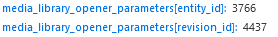

Drupal is versatile and powerful, but if we want to tell the truth, every open-source software is like that, just because you can **modify** and **adapt** every piece of the code based on your exigences.

Can you hear the great opportunity behind this?

When a problem income, and you have the skills to solve it, you shouldn't wait for a fix by a vendor or company. You should roll up your sleeves and solve the problem for yourself and others!

The existence and the essence of this article are this, in the end: I faced with a problem, so I would explain to others how I solved it, so other developers will not be faced with the same again (and because I need to write something for my blog, it is oxygen for me).

One of the main aspects of my blog is that I don't want to share only my code, but, most of all, I want to share the solution process of a particular problem. So, if you don't see a lot of code, don't worry, it is normal!

## Have you ever used a token?

We can consider a token as a placeholder; this placeholder, at the right moment, will be substituted by some value. We have a token for almost everything in the Drupal context: the site name, the node title, the node id, the random number or strings, the date, hour, and so on.

The tokens are defined in Drupal using a contrib module called *Token* ([this](https://www.drupal.org/project/token) is the official page of the project), and as with everything in the CMS, you can define your tokens. But we have a limit... we can use tokens inside the scope of the context.

For example, **you cannot use the node id token for a media element** (using the media library core module). Again, **you cannot access this information during the creation of the node itself** (it doesn't have it yet!).

It is a problem, in particular: my problem. But, let's go in order.

## \#1 Problem:

I'm using the contrib module called **File (Field) Paths** (download it [here](https://www.drupal.org/project/filefield_paths)) because I need to manage files uploaded on a specific node (with media library) using this tree directory structure:

*/attachments/{YEAR}/{NID}/{ALL_THE_FILES}*

While the year is a piece of well-known information (a token can satisfy this), the problem is that I need to use the node id inside the media element, in particular: inside the media type defined by some fields (as file field). In the first instance, you cannot use the node id token inside media fields.

## \#2 Problem:

In any case, if we can get the node id of the related node, we cannot retrieve the node id (*nid*) of a specific node before its creation, so if you are in the creation phase, the nid will be null.

The nid is not defined yet, of course.

## \#1 Solution:

For the first problem, we have a simple solution. We can create a custom token for the node id (you can see some resources -at the bottom of this page- that I used for this article and for the solution to my problems), place this token inside the configuration for the file field of the media type, and replace it with the node id at the right moment.

But, how can we retrieve the node id?

The *entity id* can be retrieved using the request that we make using the media library (during the selection of the file from the filesystem), which can be analysed using the *"network"* tab in the inspector.



At this point, retrieving this information is simple, using this code:

```php
<?php

# [...]

/**
 * Implements _hook_get_node_id().
 * This function should be called by the hook used
 * to create the custom token (see the resources).
 */
function _custom_tokens_get_node_id() {
  $path = \Drupal::request()->getRequestUri();
  $params = explode('&', $path);
  $values = [];
  $node_relationship_id = -1;
 
  foreach($params as $key => $value) {
    $explosion = explode('=', $value);
    $explosion[0] = str_replace(['%5B', '%5D'], ['[', ']'], $explosion[0]);
    $values[$explosion[0]] = $explosion[1];
  }

  if(isset($values['media_library_opener_parameters[entity_id]'])) {
    $node_relationship_id = $values['media_library_opener_parameters[entity_id]'];
  } else {
    $node_relationship_id = $_SESSION['_sf2_meta']['s'];
  }

  return $node_relationship_id;
}
```

But, if we inspect the same request made by the media library during a node creation, we can analyse that we haven't an *entity id* (because the node doesn't have it yet).

## \#2 Solution:

How can we get a piece of information that we haven't yet?

This problem is more difficult than the previous one, and the solution (at the same level) is not definitely (in my opinion)!

When the entity id is not defined the module uses the UUID of the current user that seems like a random alphanumeric string (the name look like this: *Hll5GEtkQEHHSZGQfd3p41siMYDFagOnfUHVQCrXni8*). All the files added with the media library, that does not refer to another node, will be placed into this temporary folder.

**NOTE:** If the file is related to another node, the file should not be copied or moved to another folder because it shouldn't lose its references.

After the node saving, the node id is not defined yet, and in fact, in the *presave* *hook* that we are using the nid is null. However, this nid can be retrieved using the simplest query you have ever heard:

*select the maximum node id of the node table plus the nid of one unit.*

For example: if the maximum nid of the node table is **100**, at the end we have a nid that is **101**.

After the saving of the node, all the files (stored in the temporary folder) will be moved to the right folder, using a rename of the temporary folder with the result of the query:

*/attachments/2022/**101**/{ALL_THE_FILES}*

## All fabulous, but there are limits!

The first limit that comes to my mind is the abandoned node creation. Imagine user A that want to create a node X; he compiles every mandatory field, like title or some others, and, most important of all, added some files using the media library and browse files from his computer. 

All of these files (of node X) will be added to the temporary folder renamed with the UUID of the session of the current user A.

Unfortunately, user A doesn't want anymore to continue with the node creation and leave the page (node X will exist never, but the files stored in the temporary folder continue to live...).

Again, imagine that user A wants to create another node Y, and make the same things: he compiles the mandatory field, adds some files (that will be stored in the same folder) and save the node.

In the end, we have only node Y, but the folder renamed with the nid of node Y, now, contains all the files of node X and node Y (of course, the files of node X will never be used or downloaded by anyone).

The consequence of this is that if this phenomenon will be exaggerated endlessly, we have some space busy with useless files. 

This is not a real problem because these files are not referenced by any other node, so the most important side effect is to have in a folder of a specific node more files than normal that aren't referenced by any node. 

**But, how can we solve this problem?**

We can simply create a custom CRON entity that every time analyse the files that are not related to some nodes and delete them.

This is not the final solution, otherwise, can exist this situation: we want to save a file without a node related because it is linked by another website or something like that. Using the CRON described previously, we may have the problem of the 404 for that file.

As my database's professor says every time: 

> It all depends on the context!