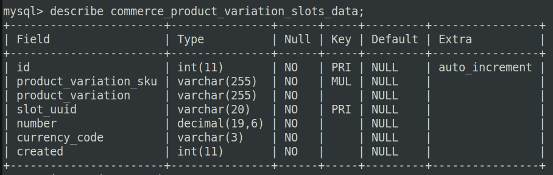
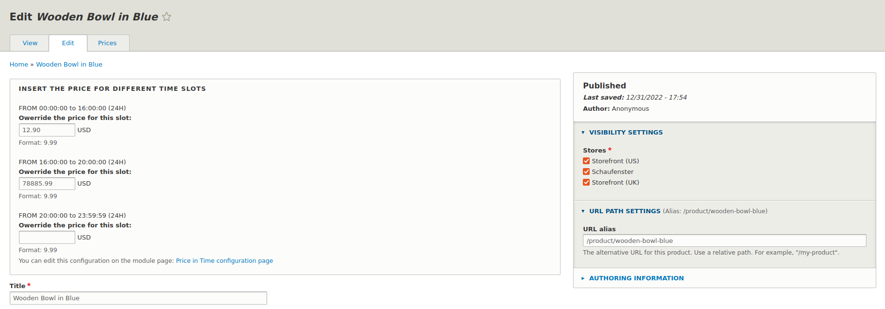

I found that **Drupal Commerce** is not just a module. It is an entire world with powerful features and objects, fundamental to every Drupal developer and builder.

But first, let me introduce what Drupal Commerce is (for the few that didn't hear about it): it is open-source software (a set of modules) which empowers Drupal as a complete e-commerce platform, including the most important payment systems and so on.

Drupal Commerce was created by **Commerce Guys** (founded by Ryan Szrama). Then, it was renamed to its current name and released version 1.0 on August 2011. It can be extended with custom code and features as a simple Drupal instance.

I'm not here to write a Wikipedia-like article about Drupal Commerce, if you want to know something about it, you can find everything on the official website: <https://drupalcommerce.org> (the documentation is DOC, as we say in Italy for quality things :-)

### The requirements:

We want to create a custom module to provide a specific price in a specific slot of time. The slot of time, of course, is dynamically changeable by the administrator. Plus, on every slot, you can set a *free shipping bonus*.

An example:

**1° slot:** 08:00-12:00 -> 10.25€ (free shipping: true)

**2° slot:** 12:00-18:00 -> 25.14€ (free shipping: false)

**3° slot:** 18:00-20:00 -> 16.00€ (free shipping: false)

The default price should be used for the product in any other case.

Let's suppose that you are visiting the product page of a product (a pair of shoes) during the morning, between **08:00-12:00**, so you should see the price of **10.25€**; instead, if you are visiting the same product page between **21:00-00:00** you should see the default price (the price set on the product).

Again, let's suppose that you are buying this pair of shoes between **12:00-18:00**, so you can see the price of **25.14€**, but you do have not access to the free shipping bonus applied to the order (because the boolean is set to false).

### How I made it:

I used Drush generate to create the prototype of the module, and I continued to use it to create the elements of my module, such as services, controllers, and so on. I suggest you use this tool in every Drupal development process: [here is the documentation](https://www.drush.org/latest/commands/generate/).

#### 1° step: the form and the alter form

The first element I created was the configuration form. The structure of the configuration saved thanks to this form is the following:

```yaml
product_variation_name:
  enabled:         # boolean
  times:
    start_time:    # time
    end_time:      # time
    free_shipping: # boolean
    UUID:          # a random string
 
 # this for each product variations.
 # [...]
```

Of course, this structure is repeated for each product variation type (retrieved by a specific method); and the slots were checked by a validator before the submission to make sure they don't overlap each other.

```php
<?php

# [...]

  /**
   * 
   * Check the two time periods overlap.
   *
   * Example:
   * $periods = [
   *    ['start_time' => "09:00", 'end_time' => '10:30'],
   *    ['start_time' => "14:30", "end_time" => "16:30"],
   *    ['start_time' => "11:30", "end_time" => "13:00"],
   *    ['start_time' => "10:30", "end_time" => "11:30"],
   * ];
   *
   * @param $periods
   * @param string $start_time_key
   * @param string $end_time_key
   * @param int $corrupted
   * @return bool
   *
   * Check the code on this page:
   *  - https://dev.to/xichlo/determine-whether-two-date-ranges-overlap-in-php-1b5a
   * 
   * Of course I understood the code that I copy&paste, and I added
   * the parameter $corrupted because I need the position of the error.
   *
   */
  private function isTimesOverlapped($periods, $start_time_key, $end_time_key, &$corrupted = null) {
    usort($periods, function ($a, $b) use ($start_time_key, $end_time_key) {
      return strtotime($a[$start_time_key]) <=> strtotime($b[$end_time_key]);
    });

    foreach ($periods as $key => $period) {
      if ($key != 0) {
        if (strtotime($period[$start_time_key]) < strtotime($periods[$key - 1][$end_time_key])) {
          $corrupted = $key - 1;
          return true;
        }
      }
    }

    return false;
  }
```

I saved this information in the configurations because this should not be changed in the future so frequently. Instead, the thing that can be changed much more often will be the price for every product in the specific slot of time. This is the reason I created a custom table with the following columns:



Where **slot_uuid** is the bridge between the specific row in this table and the specific slot of time for this **product_variation**.

But, where user can set the price for a single product? What better place than the edit page of the product itself? 
Using a form alter hook we can add a section on the top of the editing page of a node (in this case, a product) where the user can put the information such as prices for each slot.



Of course, we need to show the price-in-time section only if the editing page is for a variation product (if there is more than one variation) or for a product (if there is only one variation). Plus, only if the product belongs to a variation enabled in the module's configuration.

Adding our custom submit, we can say to Drupal that we need to insert a new record in the previous table with all the information we need after; whereas removing a specific record because we removed the price for a slot. 

Note that I wrote others helper functions that surround the whole context of the module file, such as the getter methods for the default values (for the form), etc.

You can study the code of the alter form and other hooks on my GitHub repository, but they are not the most interesting part of the module.

#### 2° step: the Price Resolver

The second step was to think of something that changes dynamically the price of a product based on specific conditions (the current time). This "something" is the **price resolver** (this is the documentation: <https://docs.drupalcommerce.org/commerce2/developer-guide/pricing/price-resolvers>).

Essentially: the price of a product is calculated dynamically by one or more price resolvers. You can use the resolver to write your module or use some other contrib modules (like Pricelist - before this custom module I read about this module but it doesn't fit my needs).

```php
<?php

namespace Drupal\price_in_time\Resolvers;

# Drupal Commerce.
use Drupal\commerce\Context;
use Drupal\commerce\PurchasableEntityInterface;
use Drupal\commerce_price\Resolver\PriceResolverInterface;
use Drupal\commerce_price\Price;

# Drupal Entity.
use Drupal\user\Entity\User;

# Drupal Core.
use Drupal\Core\Config\ConfigFactoryInterface;
use Drupal\Core\Database\Connection;
use Drupal\Core\Datetime\DrupalDateTime;

class PriceResolver implements PriceResolverInterface {

  /**
   * The config factory.
   *
   * @var \Drupal\Core\Config\ConfigFactoryInterface
   */
  protected $config_factory;

  /**
   * The database connection.
   *
   * @var \Drupal\Core\Database\Connection
   */
  protected $connection;

  /**
   * Constructs a Price Resolver object.
   *
   * @param \Drupal\Core\Config\ConfigFactoryInterface $config_factory
   *   The config factory.
   *
   * @param \Drupal\Core\Database\Connection $connection
   *   The database connection.
   */
  final public function __construct(ConfigFactoryInterface $config_factory, Connection $connection) {
    $this->config_factory = $config_factory->get('price_in_time.settings');
    $this->connection = $connection;
  }

  /**
   * {@inheritdoc}
   */
  public static function create(ContainerInterface $container) {
    return new static(
      $container->get('config.factory'),
      $container->get('database'),
    );
  }

  /**
   * {@inheritdoc}
   */
  public function resolve(PurchasableEntityInterface $entity, $quantity, Context $context) {

    $query = $this->connection
      ->select('commerce_product_variation_slots_data', 'commerce_product_slots')
      ->fields('commerce_product_slots', [
        'product_variation_sku',
        'number',
        'currency_code',
        'slot_uuid',
      ])
      ->condition('commerce_product_slots.product_variation_sku', $entity->getSku())
      ->execute()
      ->fetchAllAssoc('slot_uuid');

    if ($this->config_factory->get($entity->bundle() . '.enabled') && !empty($query)) {
      return $this->getCurrentTimeSlotPrice(
        $query,
        $entity->bundle()
      );
    } return $entity->getPrice();
  }

  /**
   * 
   * @param array $results
   * @param string $bundle
   * @return Price
   * 
   * Return the price of the specific slot of time (based on the
   * current time). This will return the price everytime because
   * we check the existence of the record before.
   * 
   */
  private function getCurrentTimeSlotPrice($results, $bundle) {
    $bundle_settings = $this->config_factory->get($bundle);
    $current_time = strtotime(date('H:i:s'));

    foreach ($bundle_settings['times'] as $key => $slot) {
      if ($current_time >= strtotime($slot['start']) && $current_time <= strtotime($slot['end'])) {
        if (isset($results[$slot['uuid']])) {
          return new Price(
            $results[$slot['uuid']]->number,
            $results[$slot['uuid']]->currency_code
          );
        }
      }
    }
  }
}
```

Resolvers are registered as a normal service in the **my_module.services.yml** file and implement an interface called **PriceResolverInterface**. In implementing this interface, we need to override consequently the method called **resolve()**.

In the end, using this method we can manipulate the price.

The code is simple:

* We get the specific row from the custom table with the following condition: the records with an SKU passed (the array should be keyed using the UUID of the slots);
* We load all the configuration information based on the bundle (the product variation);
* For every slot (the configuration) we compare the current time with all the start and end times retrieved;
* If the current time is between the start and end times of one of the slots, we return the Price object with the number and currency code specified in the record only if is set the specific UUID in the results array of the query;

#### 3° step: the Order Processor

The third step has been the most difficult for me. The search fell on the order processor (link to the documentation: <https://docs.drupalcommerce.org/commerce2/developer-guide/orders/order-refresh-and-process>). Also in this case the order processor can be registered as a simple service in the previously cited file.

I think this solves the problem: using the order processor we can apply fees or bonuses during the order processing, so using a specific bonus that will be ever equivalent to the shipping cost, we can cancel dynamically the shipping cost itself. In particular, the object that can make this magic possible is called an **adjustment**.

We can specify an adjustment using a simple YAML (called **price_in_time.commerce_adjustment_types.yml**) file and using a structure like this:

```yaml
price_in_time__free_shipping:
  label: 'Price in Time: free shipping'
  singular_label: 'price in time free shipping adjustment'
  plural_label: 'price in time free shipping adjustments'
  has_ui: true
  weight: 10
```

This adjustment will have the same cost of the shipping applied to the order and will be substituted from the order itself. This is only if the current time is between the start and end date of a specific slot and the shipping boolean is set to true.

```php
<?php

namespace Drupal\price_in_time\OrderProcessor;

# Drupal Commerce.
use Drupal\commerce_order\Adjustment;
use Drupal\commerce_order\Entity\OrderInterface;
use Drupal\commerce_order\OrderProcessorInterface;

# Drupal Core.
use Drupal\Core\Config\ConfigFactoryInterface;
use Drupal\Core\Database\Connection;
use Drupal\Core\Datetime\DrupalDateTime;

/**
 * Applies a 5% discount per high quanity item because it is Thursday.
 */
class FreeShippingOrderProcessor implements OrderProcessorInterface {

  /**
   * The config factory.
   *
   * @var \Drupal\Core\Config\ConfigFactoryInterface
   */
  protected $config_factory;

  /**
   * The database connection.
   *
   * @var \Drupal\Core\Database\Connection
   */
  protected $connection;

  /**
   * Constructs an Order Processor object.
   *
   * @param \Drupal\Core\Config\ConfigFactoryInterface $config_factory
   *   The config factory.
   *
   * @param \Drupal\Core\Database\Connection $connection
   *   The database connection.
   */
  final public function __construct(ConfigFactoryInterface $config_factory, Connection $connection) {
    $this->config_factory = $config_factory->get('price_in_time.settings');
    $this->connection = $connection;
  }

  /**
   * {@inheritdoc}
   */
  public static function create(ContainerInterface $container) {
    return new static(
      $container->get('config.factory'),
      $container->get('database'),
    );
  }

  /**
   * {@inheritdoc}
   */
  public function process(OrderInterface $order) {

    $shipment_referenced_entities = $order->shipments->referencedEntities();

    if (!empty($shipment = reset($shipment_referenced_entities)) &&
        $shipment->getAmount()->getNumber() > 0 &&
        $this->checkForFreeShippingTime($order->getItems())) {

      $order->addAdjustment(new Adjustment([
        'type' => 'price_in_time__free_shipping',
        'label' => t('Free shipping bonus'),
        'amount' => $shipment->getAmount()->multiply('-1'),
      ]));

      $order->collectAdjustments();
    }
  }

  /**
   * 
   * @param array $order_items
   * @return bool
   * 
   * This will return true if the free shipping is set for the specific
   * slot of time, otherwise false (will not apply the bonus on checkout).
   * 
   */
  private function checkForFreeShippingTime($order_items) {

    foreach ($order_items as $key => $item) {
      $purchased_referenced_entities = $item->purchased_entity->referencedEntities();
      $item_entity = reset($purchased_referenced_entities);
      $item_bundle = $item_entity->bundle();
      $item_settings = $this->config_factory->get($item_bundle);
      $current_time = strtotime(date('H:i:s'));

      foreach ($item_settings['times'] as $key => $slot) {
        if ($current_time >= strtotime($slot['start']) && $current_time <= strtotime($slot['end'])) {
          if ($slot['free_shipping']) return true;
        }
      }
    }

    return false;
  }
}
```

Given these considerations, free shipping will be applied only if in the order there is at least one of the product of product variations enabled in the configuration of the module.

All the other things of the module are siding things, such as permissions, routing, info files, etc. You can give a look at the whole code and structure on my GitHub repository: [here](https://github.com/mariolinguito/price-in-time).

### What can be improved:

Today, the slot is fixed to the number of four, but one day can be added Ajax handlers to make time slots dynamically added or removed for each product variation (on the module configuration page).

Again, add unit tests (or tests in general) to make sure that the code works properly in every case.

And again, dynamically create a **Shipment method** (for the free shipping bonus) so that in the checkout process we can use it (instead of the bonus - more suitable for discounts or gift cards).