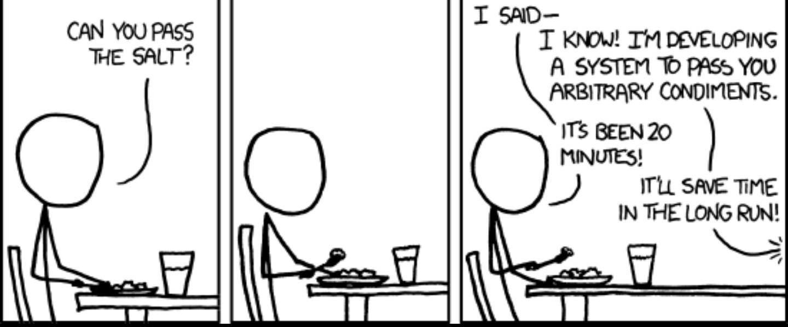

We live in a world where everything must be complex. In the programming world, this phenomenon is exasperated (I fell into this trap of complexity in the past). We want to use the last framework, the most complex infrastructure, the programming language of the moment, and the fastest technology ever.

But why? Do we need this?

In a smaller way, this happens also in the Drupal world: every time a task should be done, we need to make a module for that. But, sometimes we need only a piece of code.

An example. I created some administration pages for some particular roles, abled only for specific content types. These roles are not able to create or manage menu items, so I need something to create automatically a menu item for those contents in a specific menu and under a parent item.

Maybe there is a module that makes the magic, but this module surely will make other things that I don't need. I need something simpler than a module.

I wrote a piece of code that make the thing for me:

```php
<?php

/**
 * Implements hook_entity_insert().
 */
function hook_entity_insert(EntityInterface $entity) {
  _hook_entup_menu_link($entity);
}

/**
 * Implements hook_entity_update().
 */
function hook_entity_update(EntityInterface $entity) {
  _hook_entup_menu_link($entity);
}

/**
 * Implements _hook_entity_entup_menu_link().
 */
function _hook_entup_menu_link($entity) {

  if ($entity->bundle() === 'content_type_machine_name') {
    MenuLinkContent::create([
      'title' => $entity->getTitle(),
      'link' => [
        'uri' => 'internal:/node/'.$entity->id()
      ],
      'menu_name' => 'main',
      # you should specify the view name and view display, of
      # course without brackets.
      'parent' => 'views_view:views.{view_name}.{view_display}',
    ])->save();
  }
}
```

On every insert and update of specific content, this code will create a menu item under a specific parent item, automatically. Of course, an administrator can change the item because the code checks if the menu item is available or not.

This code can be improved, obviously; it can be extended in a module. But, for me, this basically works without a problem.

The meaning is: not in every case we should complicate our life with complexity. Sometimes we need only simplicity.