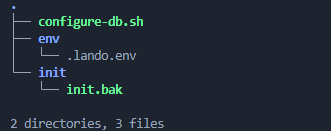

If you want to use SQL-Server by Microsoft on your Lando environment, you may encounter several difficulties. This is because (according to me) SQL-Server is difficult in any case \[especially if you use most of the time MySQL or MariaDB  :-]

Lando is perfect for local development if you are a Drupal \[or WordPress] developer because it is based on Docker, and makes development speed than other tools \[XAMPP, I'm looking at you]. I'm using Lando on my WSL Ubuntu LTS installed on Windows 11, and it goes great!

Again, Lando has a lot of plugins that you can use, especially for your database: MySQL, MariaDB, MongoDB, Postgres, and SQL-Server [[here](https://docs.lando.dev/plugins/mssql/) is the official page of the plugin]. Using this last, for me, is a tremendous hell!

## When you're forced!

Seeing the [ranking](https://db-engines.com/en/ranking), SQL-Server is the third most used worldwide, so you will necessarily meet him in some project order. 

Therefore, let's go swimming in the river Acheron.

First of all, we need to know that Lando is based on a specific configuration file called **.lando.yml** [that we can [override with other YML files](https://docs.lando.dev/core/v3/#override-file), if necessary].

A Lando configuration file looks like this:

```yaml
name: my-drupal-site

# Configuration for services
services:
  appserver:
    type: php:8.1
    name: appserver
    # Define additional PHP extensions or configuration here if needed
    build:
      - apt-get update && apt-get install -y libpng-dev libjpeg-dev libfreetype6-dev
    volumes:
      - ./web:/var/www/html
    # Environment variables for Drupal settings
    overrides:
      environment:
        DRUPAL_DB_HOST: database
        DRUPAL_DB_NAME: drupal
        DRUPAL_DB_USER: drupal
        DRUPAL_DB_PASSWORD: drupal
    # Expose ports or other service settings
    ports:
      - "8080:80"

  database:
    type: mysql:8.0
    name: database
    # Environment variables for MySQL settings
    overrides:
      environment:
        MYSQL_ROOT_PASSWORD: root
        MYSQL_DATABASE: drupal
        MYSQL_USER: drupal
        MYSQL_PASSWORD: drupal

  # Optional: Redis service for caching
  redis:
    type: redis:7
    name: redis

  # Optional: Solr service for search
  solr:
    type: solr:8
    name: solr
    ports:
      - "8983:8983"

# Tools are optional but useful for managing tasks
tooling:
  drush:
    service: appserver
    description: "Run drush commands"
  composer:
    service: appserver
    description: "Run composer commands"

# Optional: Define any additional environment variables or settings
config:
  webroot: web
  xdebug: true
  mailhog: true

# Optional: Define any custom build steps or other configuration
hooks:
  post-start:
    - lando drush cr # Clear cache after starting
  post-import:
    - lando drush updb # Run database updates after importing data
```

### Some explanation about this YAML:

1. **`name`**: define the name of your Lando project.
2. **`services`**: 

   * `appserver`: defines the PHP service, which is used to run the Drupal site. You can customize PHP settings and extensions as needed.
   * `database`: defines the MySQL database service with environment variables for root password, database name, and user credentials.
   * `redis`: optional service for caching, if you use Redis.
   * `solr`: optional search service, if you use Apache Solr.
3. **`tooling`**: 

   * `drush`: a tool to run Drush commands (Drupal shell).
   * `composer`: a tool to run Composer commands for managing PHP dependencies.
4. **`config`**: 

   * `webroot`: specifies the root directory for your Drupal site.
   * `xdebug`: enables Xdebug for debugging (optional).
   * `mailhog`: enables Mailhog to catch emails sent by Drupal (optional).
5. **`hooks`**: 

   * `post-start`: commands to run after the Lando environment starts.
   * `post-import`: commands to run after importing a database or other data.

If you want to make this in pure Docker, ehm, it will be very complex!

## Use MSSQL in a Lando configuration file

Following Lando documentation, if you want to use the MSSQL plugin you just use it like this:

```yaml
services:
  myservice:
    type: mssql
```

But it is not so easy. You need to configure something to make this work well.

1. SQL-Server changed the directory of the bin of **sqlcmd** \[the old directory is: /opt/mssql-tools/bin, while the new is: /opt/mssql-tools18/bin];
2. To use SQL-Server with Drupal, again, you need two PHP extensions: **sqlsrv** and **pdo_sqlsrv**; this means that you need to install them on your appserver service. Thanks to an issue reported by a user called mikemilano we can make that;
3. We need to automate some boring stuff, like the import of a database with BAK init file and some like this \[I make a script that can help us];

All of these big words become this YAML file:

```yaml
name: drupal-with-sqlserver
recipe: drupal10
config:
  webroot: web
  database: sqlserver
services:
  appserver:
    type: php:8.1
    build_as_root:
      - apt-get update -y
      - apt-get install apt-transport-https -y
      - curl https://packages.microsoft.com/keys/microsoft.asc | apt-key add -
      - curl https://packages.microsoft.com/config/debian/11/prod.list > /etc/apt/sources.list.d/mssql-release.list
      - apt-get update -y
      - ACCEPT_EULA=Y apt-get install -y msodbcsql18
      - apt-get install unixodbc-dev -y
      - pecl install sqlsrv
      - pecl install pdo_sqlsrv
      - docker-php-ext-enable sqlsrv
      - docker-php-ext-enable pdo_sqlsrv
  database:
    type: mssql
    creds:
      password: {your_sa_password}
    healthcheck: "sqlcmd -U sa -H sqlserver -P {your_sa_password} -Q quit -N o"
    path:
      - '/usr/local/sbin'
      - '/usr/local/bin'
      - '/usr/sbin'
      - '/usr/bin'
      - '/sbin'
      - '/bin'
      - '/opt/mssql-tools18/bin'
 
    version: '2019-latest'
    portforward: 10433
    run_as_root:
      - chmod +x /mssql/configure-db.sh
      - /mssql/configure-db.sh
    overrides:
      volumes:
        - ~/.lando/mssql:/mssql
tooling:
  composer:
    service: appserver
    cmd: composer
events:
  pre-start:
  - appserver: composer require drupal/sqlsrv
```


If you are looking at **lines 37 to 42**, let me explain. I need a method to create a user \[different from sa] and give some privileges. Again, I want to make this using environment variables.

Again, using overrides we mount the *~/.lando/mssql* directory from your local machine into the */mssql* directory inside the container. This means that any files in *~/.lando/mssql* on your host machine will be accessible in the container at the */mssql* path.

In this folder, we have:



### Environment variables:

Following the structure shown, in the env directory, we have a specific env file in which we can write all environment variables we need, like this:

```yaml
# MSSQL envs.
#
MSSQL_USERNAME=drupal10
MSSQL_PASSWORD=ZsL82^kbn
MSSQL_DBNAME=drupal10
MSSQL_DBDATA=drupal10_Data
MSSQL_DBLOG=drupal10_Log
```

You can change them and add your env variables based on your needs and your application.

### Initializing the database with BAK:

In the folder called **init**,we can put a BAK file that we want to import during the Lando bootstrap of the project [of course, we need to set some variables to make this, and in particular the **MSSQL_DBDATA** and **MSSQL_DBLOG** if necessary and restoring process requires them].

Note that the name of the BAK needs to be **init.bak** to make the script work well \[you will see now why].

### The real script:

```shell
#!/bin/bash

# Source the .lando.env file to load environment variables.
if [ -f /mssql/env/.lando.env ]; then
    echo "Loading environment variables from .lando.env"
    set -a
    . /mssql/env/.lando.env
    set +a
    echo "Environment variables loaded."
else
    echo ".lando.env file not found."
fi

# Use the environment variables.
echo "Reading ENV variables..."
echo "*************************"
echo "DB user: $MSSQL_USERNAME"
echo "DB name: $MSSQL_DBNAME"
echo "DB data: $MSSQL_DBDATA"
echo "DB log: $MSSQL_DBLOG"
echo "*************************"

# Create a new database on lando rebuild.
sqlcmd -U sa -H sqlserver -P $SA_PASSWORD -C -Q "IF NOT EXISTS (SELECT * FROM sys.databases WHERE name = '$MSSQL_DBNAME') BEGIN CREATE DATABASE $MSSQL_DBNAME; END"

# Create user and password.
sqlcmd -U sa -H sqlserver -P $SA_PASSWORD -C -Q "CREATE LOGIN $MSSQL_USERNAME WITH PASSWORD = '$MSSQL_PASSWORD'"

# Create a login for specific database.
sqlcmd -U sa -H sqlserver -P $SA_PASSWORD -C -Q "CREATE USER $MSSQL_USERNAME FOR LOGIN $MSSQL_USERNAME"

# Assign role to database.
sqlcmd -U sa -H sqlserver -P $SA_PASSWORD -C -Q "ALTER ROLE db_owner ADD MEMBER $MSSQL_USERNAME"

# Set autoclose for the database.
sqlcmd -U sa -H sqlserver -P $SA_PASSWORD -C -Q "ALTER DATABASE $MSSQL_DBNAME SET AUTO_CLOSE OFF"

# Define the folder path
folder_path="/mssql/init/"

# Check if the folder contains only files named init.bak
if [ -n "$(ls -A "$folder_path")" ] && [ -z "$(ls -A "$folder_path" | grep -v '^init\.bak$')" ]; then
    # All files are named init.bak, execute your command here
    echo "Executing restore of BAK databases..."
    # Replace the following line with the command you want to execute
    sqlcmd -U sa -H sqlserver -P $SA_PASSWORD -C -Q "RESTORE DATABASE $MSSQL_DBNAME FROM DISK = '/mssql/init/init.bak' WITH MOVE '$MSSQL_DBDATA' TO '/var/opt/mssql/data/lando_data.mdf', MOVE '$MSSQL_DBLOG' TO '/var/opt/mssql/data/lando_log.ldf', NOUNLOAD, REPLACE;"
else
    echo "Folder is not full of init.bak files or is empty."
fi
```

Okay, all goods, but let me explain some pieces of the code \[at least the darkest ones]:

```shell
if [ -f /mssql/env/.lando.env ]; then
    echo "Loading environment variables from .lando.env"
    set -a
    . /mssql/env/.lando.env
    set +a
    echo "Environment variables loaded."
else
    echo ".lando.env file not found."
fi
```

The purpose of this section is to check if the file **/mssql/env/.lando.env** exists. If the file exists, it loads environment variables from **.lando.env**. While `set -a` tells the shell to automatically export all variables, making them available to the script. On the other hand, `set +a` stops exporting all variables automatically after the file is sourced. If the file is not found, it prints a message indicating that the file is missing.

```shell
folder_path="/mssql/init/"

if [ -n "$(ls -A "$folder_path")" ] && [ -z "$(ls -A "$folder_path" | grep -v '^init\.bak$')" ]; then
    echo "Executing restore of BAK databases..."
    sqlcmd -U sa -H sqlserver -P $SA_PASSWORD -C -Q "RESTORE DATABASE $MSSQL_DBNAME FROM DISK = '/mssql/init/init.bak' WITH MOVE '$MSSQL_DBDATA' TO '/var/opt/mssql/data/lando_data.mdf', MOVE '$MSSQL_DBLOG' TO '/var/opt/mssql/data/lando_log.ldf', NOUNLOAD, REPLACE;"
else
    echo "Folder is not full of init.bak files or is empty."
fi
```

The purpose of this section is to check the **/mssql/init/** folder for any files and ensure they are named **init.bak**. If the folder contains only init.bak files, it proceeds to restore the database from the backup file. The `RESTORE DATABASE` command restores the database, moving the data and log files to the specified paths. If the folder is empty or contains files other than init.bak, it skips the restoration process.

In the middle part of the script, we create the user \[with the password] that is specified by environment variables and give it the privileges on the database.

To test our new user, we can use DBeaver [[here](https://dbeaver.io/) the official page]:


## Conclusions

In the end, I need to say that this is not the best approach ever, but it can be a starting point to make something greater than this.

So, I hope that this mini-tutorial article can help you in the fight against SQL-Server \[we are joking! Microsoft a lot of thanks for WSL! :-]

At the bottom, there are some sources that you can read to clarify your idea about this topic.

## Some sources

* <https://github.com/lando/mssql/issues/36>
* <https://github.com/lando/lando/issues/1796>
* <https://docs.lando.dev/>