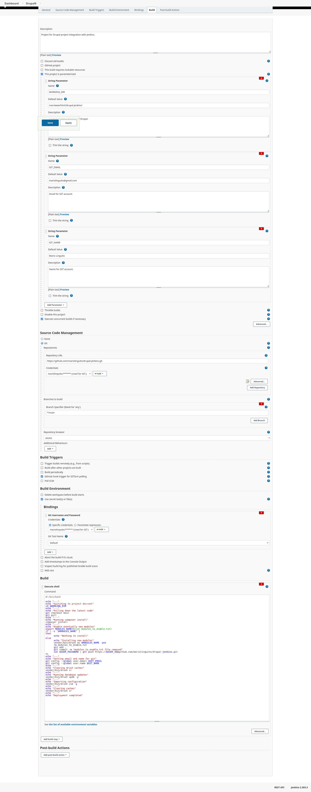

Before a web developer, I'm a tremendously curious person; I try everything, from Kubernetes (for certification, I hope) to new programming languages, from pixel designing to game development (about that, I'm going to approach this fascinating world), and so on. Definitively, there are no fields that are not interesting for me; these are not only tech fields. I'm also fascinated by writing and reading books (especially thriller), puzzle games (as Professor Layton, of course), and others.

During these days, I'm thinking about Drupal development and how to make deployments more efficient and fast, and something comes to my mind: **Jenkins**.

Technically, Jenkins is pretty simple to understand, in fact: *Jenkins is an open-source automation server. It helps automate the parts of software development related to building, testing, and deploying, facilitating continuous integration and continuous delivery. \[from Wikipedia, cited]*

Simpler, Jenkins help you to make your life easier, only after making your days on initial configuration the **worst** of your life. A compromise we can accept, after all.

## How we can use Jenkins with Drupal

First of all, the thing that allows automating Drupal is the magnificent configuration management (want to know more? Okay, follow this link).

Well, since we made an introduction about what is Jenkins and what we use from Drupal to make an integration with it, we can say what we need to make all things get done.

Of course, we need a Drupal installation somewhere. For this article, I downloaded and configured an example instance of Drupal 9 (using *composer*, which is the best practice). Then, I hosted my source code on **Github** and use **Lando** for local development (if you never hear about Lando, I suggest you look at it, mostly if you are a LAMP developer). In the end, I have a Drupal website on my local machine that I can edit and push on my branches.

Another thing that we need at this moment is a Jenkins implementation *up and running*. We can download Jenkins from its official website, and since I'm using Linux, I can follow the commands that Jenkins Team gently listed on its website or if you want, you can download the installer file from the repository.

**Little note:** I tried to install Jenkins on Windows, so I can leave my main operating system free of trash, and it was taken about hours (without success); in the end, I created a Xubuntu virtual machine and I installed Jenkins in 10 minutes (really, just 10 minutes).

I will not explain how to install Drupal or Jenkins because it is not the main topic of this post; instead, I like to show how I made all the things about integration so you can use this as a prototype to make something better and greater. In my article, I want to avoid explaining step by step how things works, because this is not a tutorial, this is more a logbook (as the whole blog).

**Another important note:** I pushed all my code on Github, but I haven't followed all the versioning' *best practices*; this is a test, I'm learning this to make the same thing later and better on a real project.

At the end of this step, we have a Drupal 9 hosted on Github, this is the link: \[GITHUB]

### Configure the Jenkins: our great butler

As in every thriller story, the butler is the kidnapper... I'm kidding now, installing Jenkins is simple and fast; it became more difficult if you are on a new machine (like my virtual machine) because you need to download OpenJDK from the official website (since I'm using Linux, it is a single command).

After the starting of the Jenkins service, we will redirect to the installation page; after the installation process, we can use the main dashboard. Using this dashboard we can start with a new project (I choose a freestyle project) and put some basic configurations like the repository URL and the branch to monitor.

Firstly, in the action to do for the job I put my script for Drupal deployment, it is pretty simple.

\[SCRIPT]

It is simple because it is what I do every time that I need to deploy a change or a feature. It is parameterized with some variables that I defined previously in Jenkins, as the path or my application, and so on. There are some parameters defined in it, this is because we define the same parameters into Jenkins project settings to make the whole project as dynamic as possible.

That's it! With this configuration and Jenkins running, we can build our environment by just pressing a button (since we defining parameters the button become **Build with parameters**) and see that everything just works.

\[IMG]

But, we have two problems:

1. Sometimes I need to install some modules and enable it, so we need to give to Jenkins the possibility to read from the file what is the machine name of the modules and enable it with Drush,
2. The second problem is that we just need to press the button to start the process, but I want that everything starts automatically when I push something to the main branch of the project;

For the first problem, we described the solution in the point itself, so, as I said, I will put a file called "modules_to_enable.txt" in the main directory of Drupal and Jenkins will read it and use it with the command; after that, Jenkins will delete the file from the root.

So, the script becomes this:

\[SCRIPT]

We cannot leave this file on the repository after we used it, so we need to push the change we made (the deletion of the file). If we push something, Github asks for a username and password, and Jenkins already know this information because we used credentials to connect Jenkins and Github. So, the only thing to do is to check the option *"Use secret text(s) or file(s)",* choosing what is the credentials to use, and using **$USER_ID** and **$USER_PASSWORD** token to make the push (in the script).

For the second problem, we have the following paragraph.

### Configuring GitHub with webhooks

The first problem I should face: I'm in localhost, I haven't a remote environment (for now) that I can use to work with, but webhooks need a remote endpoint. Well, in the past I had this problem but for another task: how can I expose my localhost to someone (for tests, an example)? I used ngrok in the past, but through the years I found another tool called **Localtunnel**.

With a single command, I can expose my port and access the website from anywhere using a link that looks like this: *https://gentle-impala-38.loca.lt* (I love the name); now, we need to configure webhooks on the specific repository.

Fortunately, Github has made the process of creation of webhooks more easily than ever. On every repository, we can edit the settings, and consequently the webhooks related to it.

The events I want to hook are the *push* and *pull requests* on the main branch*.* There are a lot of events we can trigger, but for now, we have a simplified context (in a real-world application, maybe you will check more options).

\[IMG]

## Conclusion: Okay, what we have done?

The following GIF show how the whole process start and end (I'm pushing directly into the main branch, but in a real-world scenario there would be another branch that would be merged with the main branch):

\[GIF]

Practically, every time that we push on the main branch or make a merging of some branch to the main since *webhooks allow external services to be notified when certain events happen* it makes a POST request to the specific URL we set before, and start a build into Jenkins job that make some things, the things that we specified into the script.

In conclusion, we can say that a developer needs to know Jenkins and need to broaden horizons to discover a new way to make things done. I'm a developer right down to the marrow, I love to see the backside of everything and I love to work as a back-end developer, but I need to know also how certain things works that are outside to the *"web development world"*.