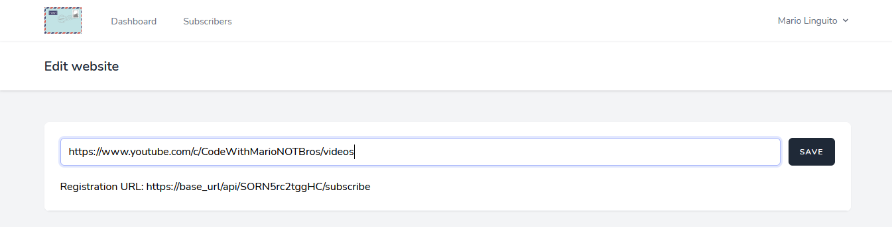

Initially, the first thought coming to mind about Codsletter is that it is perfect only for the blog and website. But, I can say a beautiful thing: you can use it for almost everything.

In this post, that seems more a note than an article, I can make some examples about how to use Codsletter for different sources:

* Youtube channel,
* Spotify podcast,
* Instagram account;

I'm writing this before the updates that I want to release this month about some improvements to the software.

## Youtube channel, give a boost to your video:

Like every blog, also Youtube channel has a list of videos that a specific uses released during channel life. So, potentially this page can be assimilable as a blog.

An example, my channel list of video are this: *<https://www.youtube.com/c/CodeWithMarioNOTBros/videos>*

You can see that all videos are listed on this page, so we can use them as source endpoint in Codsletter. But, first of all, we need to get the title tag that Codsletter should use to check if there are some new videos.

Fortunately, we can use the fabulous inspector of Firefox (pss. use Firefox instead of Chrome), as you can see in the screen following:

The result is that the title tag is: *a.video-title* because the main tag is *<a>* and the id is *\#video-title*.

At this point, if you know how Codsletter works, you should know that we need to put first the source endpoint into the specific page of the software:

Then, you should set the title tag into the settings page, plus the other information the software needs to know:

Congrats, you can now share the form across the Internet and keep your subscribers up to date on your last videos.

## Spotify podcast, update update update:

Unfortunately, I haven't a podcast yet. So I chose a podcast on Spotify: Marco Montemagno.

Also in this case we have a complete list of the last podcast user published, for example, *<https://open.spotify.com/show/7LnNntKIYAxPdyvcrsvjej>*

Practically we need to repeat the same operation we did for Youtube. Using the inspector, we need to get the title tag that we should set into Codsletter.

In this case, the title tag is *a.h4*; getting this, you can set the title tag into Codsletter both the source endpoint (the link we write before).

You can see the screen following to see how I made this:

## LITTLE BONUS: you can use it also for Instagram...

Ladies and gentlemen, you can use Codsletter also on Instagram.

I don't want to repeat myself, but considering that also an Instagram profile is a list of posts, we can inspect an element and get its title tag, as we made for the first two examples.

In this case, we consider the Instagram profile of Linux Foundation: *<https://www.instagram.com/linux_foundation/?hl=it>*

So, inspecting the element we can get our title tag and use it into Codsletter: *a.div.img* as we can see from the screen:

\[IMG]

## Conclusion:

Of course, this note has a second purpose: showing how Codsletter is flexible, adaptive, and powerful, so you can use it for almost everything on the Internet. This is because almost everything (sorry for the repetition) is a list of things.

I want to say, in the end, that Codsletter is completely free to use (practically, I do not earn any cents from it) and it is open-source, in fact, you can check the whole code on my GitHub profile: *<https://github.com/mariolinguito/codsletter>* (I hope you can help the software with your contribution, there is a list of to-do tasks you can do).